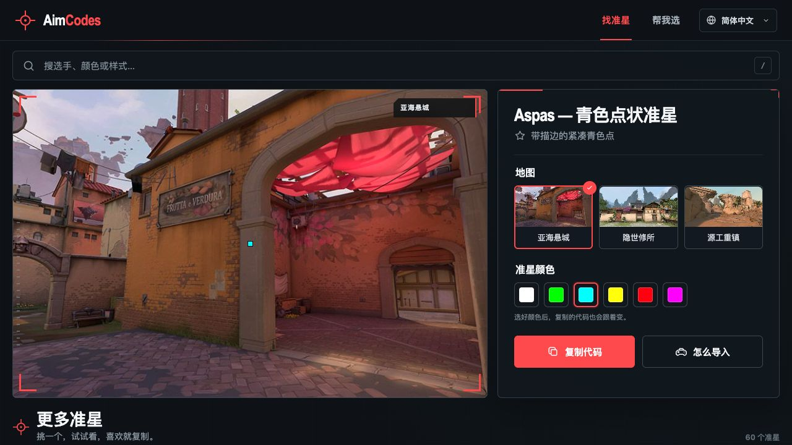

# AimCodes｜多语种无畏契约准星工具

[AimCodes](https://aimcodes.com/zh-cn/) 是一个面向全球《无畏契约》玩家的准星发现与推荐工具。玩家可以在真实地图场景中预览准星、修改颜色、复制最终代码，也可以完成三轮反应测试，让系统直接推荐一个更适合自己的准星。



## 为什么做这个项目

多数准星数据库都在解决“收录更多准星”的问题，但用户真正面对的是另外两个问题：

1. 准星太多，不知道应该从哪一个开始试。
2. 代码本身无法直观体现实际游戏画面中的效果。

AimCodes 将核心流程压缩为“预览 → 调整 → 复制”，并增加反应测试推荐，让不想逐个筛选的玩家也能快速拿到一个首选准星。

## 核心功能

- 408 条经过解析的准星代码，外观去重后 400 种可见样式；职业选手同款保留独立配置档案
- 12 个原创形态家族，覆盖小点、开放十字、跟枪、单双层线、横纵轴和高可见度框架
- 大目录分批加载，搜索与筛选始终作用于完整准星库
- 在亚海悬城、隐世修所和源工重镇场景中实时预览
- 6 种颜色预设，预览和最终复制代码同步更新
- 三轮反应速度测试和 9 个无畏契约风格的反应段位
- 测试结束后只推荐一个首选准星，并可直接预览、调色和复制
- 一键把当前准星、地图和颜色发给队友，对方打开后可直接继续预览和复制
- 英语、西班牙语、巴西葡萄牙语、简体中文和日语界面
- 桌面端与移动端响应式适配
- GA4 漏斗埋点，共验证 25 个关键事件，成功分享使用统一口径，不采集用户输入的具体搜索词
- 五语种关于、代码检查方法、隐私、条款和联系页面
- AdSense 页面投放白名单，默认排除反应测试、政策页、错误页与薄内容页

## 产品差异化

这个项目没有把“准星数量”作为唯一竞争点，而是围绕玩家的实际决策路径进行设计：

| 用户问题 | AimCodes 的解决方式 |
|---|---|
| 不知道选哪个准星 | 通过反应测试只推荐一个首选结果 |
| 不知道代码在游戏里长什么样 | 在真实地图场景中直接预览 |
| 喜欢形状但不喜欢颜色 | 修改颜色时同步生成新代码 |
| 海外同类站点以英语为主 | 同时覆盖中文、西语、巴西葡语和日语用户 |
| 工具站有流量但不知道用户做了什么 | 使用 GA4 记录搜索、筛选、测试、调色和代码复制行为 |

## 多语种路由与 SEO

| 语言 | 路径 | `hreflang` |
|---|---|---|
| 英语 | `/en/` | `en` |
| 西班牙语 | `/es/` | `es` |
| 巴西葡萄牙语 | `/pt-br/` | `pt-BR` |
| 简体中文 | `/zh-cn/` | `zh-Hans` |
| 日语 | `/ja/` | `ja` |

生产构建会为每个语种生成独立 HTML 入口，并配置：

- 本地化标题和页面描述
- 指向自身语言页面的 canonical
- 五语种双向 `hreflang` 和 `x-default`
- Open Graph 分享信息
- `robots.txt` 与多语种 sitemap
- 独立准星 Sitemap 与图片 Sitemap
- Netlify 根路径跳转和旧 `?lang=` 链接兼容

## 技术栈

- React 19 + Vite
- Canvas 准星渲染
- 原生 CSS 响应式界面
- Netlify 托管与路由配置
- Google Analytics 4
- GitHub Actions 自动验证

## 本地运行

```bash
pnpm install
pnpm dev
```

生成并预览生产版本：

```bash
pnpm build
pnpm preview
```

## 自动验证

```bash
pnpm task:context
pnpm check:auto
pnpm check:release
```

`check:auto` 按本次变更选择 quick、data、SEO 或 release 检查；PR 与生产发布前始终运行 `check:release`。结构化结果写入被 Git 忽略的 `.aimcodes-reports/current/`，供 GPT/Cursor 审核。完整说明见 [开发流程](docs/DEVELOPMENT_WORKFLOW.md)。

验证覆盖：准星代码解析与调色、重复样式识别、推荐结果完整性、五语种词条一致性、分享链接与预览还原、GA4 事件、语言路由、canonical、`hreflang`、robots、sitemap、信任页面、图片和未来广告安全边界。

AdSense 账号侧提交、真实发布商 ID、CMP 与 `ads.txt` 的执行顺序见 [`docs/ADSENSE_SUBMISSION.md`](docs/ADSENSE_SUBMISSION.md)。

## 项目结构

```text
src/components/       界面与 Canvas 组件
src/data/             准星和预览数据
src/i18n/             五语种词典与语言路由
src/utils/            代码解析、推荐算法和数据分析逻辑
scripts/              可复现的构建与验证脚本
automation/skills/    可由 Codex 调用、由 GitHub 共享的项目 Skill 源文件
public/               品牌、SEO 和公开素材
netlify.toml          生产构建、跳转规则和安全响应头
```

## 免责声明

AimCodes 是独立的玩家工具项目，与 Riot Games 不存在关联，也未获得 Riot Games 的认可或赞助。VALORANT 及相关游戏素材的商标和权利归各自权利人所有。
